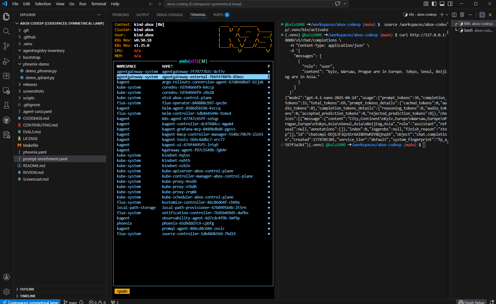
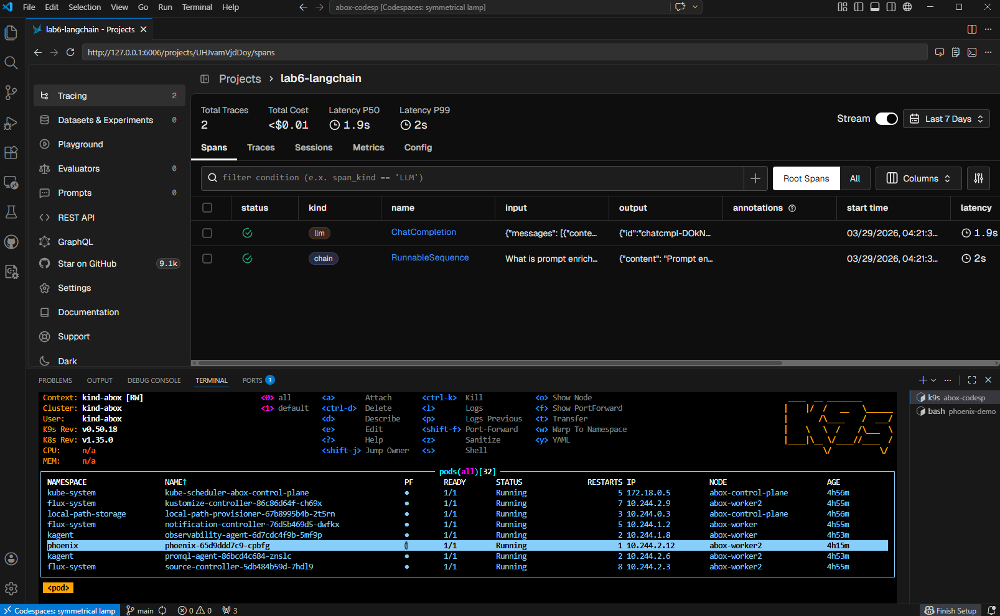

# Prompt-Enrichment-Tracing-and-Evaluating-for-LangChain-Application

## Prompt Enrichment (abox)

---

### Kubernetes Policy (AgentGateway)

```yaml
apiVersion: agentgateway.dev/v1alpha1
kind: AgentgatewayPolicy
metadata:
  name: prompt-enrichment
  namespace: agentgateway-system
spec:
  targetRefs:
    - group: gateway.networking.k8s.io
      kind: HTTPRoute
      name: llm
  backend:
    ai:
      prompt:
        prepend:
          - role: system
            content: "Convert response to CSV format."

```

### Перевірка

curl http://127.0.0.1:8080/v1/chat/completions \
  -H "Content-Type: application/json" \
  -d '{
    "messages": [
      {
        "role": "user",
        "content": "Kyiv, Warsaw, Prague are in Europe. Tokyo, Seoul, Beijing are in Asia."
      }
    ]
  }'


*Результат роботи Prompt Enrichment через agentgateway*


Prompt Enrichment було реалізовано через AgentgatewayPolicy, прив’язану до HTTPRoute.

Після застосування політики:
system prompt додається автоматично
поведінка моделі змінюється без змін у клієнтському коді
відповідь стає структурованою

## Tracing and Evaluating (LangChain + Phoenix)

Для цієї частини використовувався Phoenix, який вже розгорнутий у кластері `abox`.

---



LangChain application успішно виконує запит до моделі
Phoenix tracing підключений через HTTP endpoint
Trace відображається у Phoenix UI